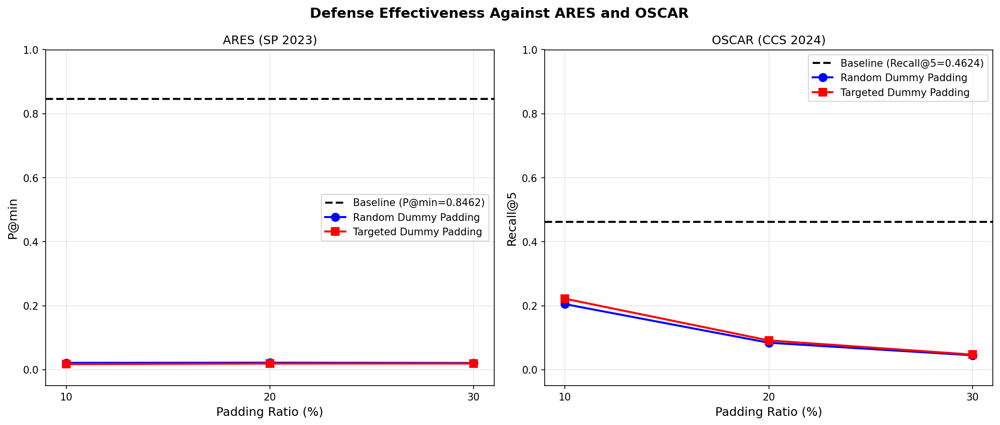
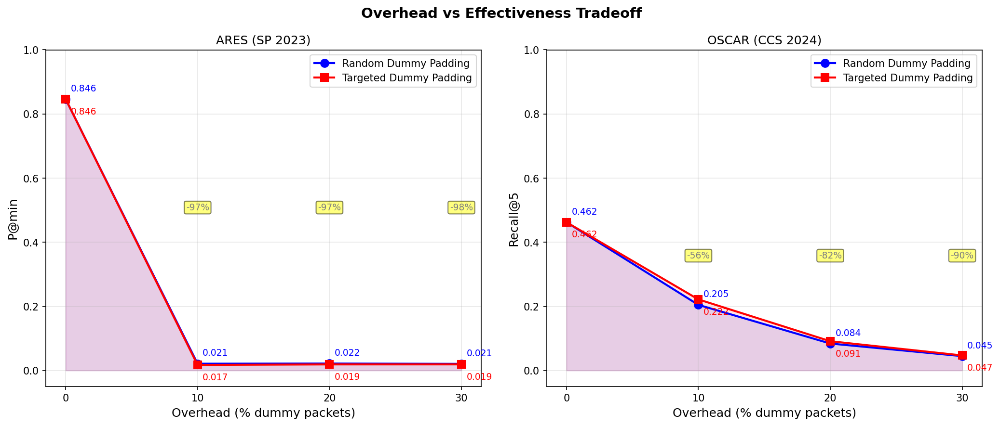

# Adversarial Dummy Packet Injection: Defense Against Website Fingerprinting

[](https://python.org)
[](https://pytorch.org)

## Overview

This project implements and evaluates **Adversarial Dummy Packet Injection (ADPI)**, a practical defense mechanism against state-of-the-art Website Fingerprinting (WF) attacks over Tor. We evaluate ADPI against two recent attacks:

- **ARES** (IEEE S&P 2023) — Multi-tab WF attack using transformer-based local pattern matching
- **OSCAR** (ACM CCS 2024) — Fine-grained webpage fingerprinting using metric learning

The core idea of ADPI is to insert carefully crafted dummy packets **between real packets** in the traffic stream, disrupting the statistical patterns that WF classifiers rely on — without modifying or deleting any original packets.

---

## Defense Mechanism

We implement two variants of ADPI:

### 1. Random Dummy Padding (RDP)
Inserts dummy packets at random positions within the real traffic region. Each dummy packet has a randomly chosen direction (±1) and a small random timestamp, simulating realistic inter-packet delays.

### 2. Targeted Dummy Padding (TDP)
Inserts dummy packets strategically to push the traffic fingerprint toward a randomly chosen **decoy website**. For example, if the user is visiting Amazon, TDP inserts packets that make the traffic resemble Facebook — causing the classifier to misidentify the visited site.

The targeting works by:
1. Selecting a random decoy website w* ≠ true website
2. Computing the mean traffic signature of w*
3. Inserting packets at positions that maximize cosine similarity between the perturbed traffic and the decoy signature

---

## Results

### Against ARES (P@min metric)

| Defense | Overhead | P@min | Reduction |
|---------|----------|-------|-----------|
| Baseline | 0% | 0.846 | — |
| Random Dummy Padding | 10% | 0.021 | 97.5% |
| Random Dummy Padding | 20% | 0.022 | 97.4% |
| Random Dummy Padding | 30% | 0.021 | 97.5% |
| Targeted Dummy Padding | 10% | 0.017 | 97.9% |
| Targeted Dummy Padding | 20% | 0.019 | 97.7% |
| Targeted Dummy Padding | 30% | 0.019 | 97.7% |

### Against OSCAR (Recall@5 metric)

| Defense | Overhead | Recall@5 | Reduction |
|---------|----------|----------|-----------|
| Baseline | 0% | 0.462 | — |
| Random Dummy Padding | 10% | 0.205 | 55.7% |
| Random Dummy Padding | 20% | 0.084 | 81.8% |
| Random Dummy Padding | 30% | 0.045 | 90.3% |
| Targeted Dummy Padding | 10% | 0.222 | 52.0% |
| Targeted Dummy Padding | 20% | 0.091 | 80.2% |
| Targeted Dummy Padding | 30% | 0.047 | 89.8% |

### Key Findings
- With only **10% overhead**, ADPI reduces ARES accuracy by **97.5%**
- With **30% overhead**, ADPI reduces OSCAR accuracy by **90%**
- ADPI never modifies original packets — only adds dummy ones
- ARES is more sensitive to dummy packet insertion than OSCAR due to its local pattern-based feature extraction

---

## Visualizations

### Defense Effectiveness


### Overhead vs Effectiveness Tradeoff


---

## Repository Structure
WF-Defense-Project/
├── WF_Defense_Notebook.ipynb    # Main notebook with all code
├── results/
│   ├── ares_defense_results.json
│   ├── oscar_defense_results.json
│   ├── defense_results.png
│   └── overhead_vs_effectiveness.png
└── README.md---

## Datasets

- **ARES dataset**: [Zenodo record 13732130](https://zenodo.org/records/13732130) — closed_2tab, 100 websites, 2-tab browsing
- **OSCAR dataset**: [Zenodo record 13383332](https://zenodo.org/records/13383332) — closed-world, 1,000 webpages

---

## Setup and Reproduction

### Requirements
```bash
pip install torch numpy scikit-learn tqdm pytorch-metric-learning pandas tensorboard
```

### Running the Notebook
1. Open `WF_Defense_Notebook.ipynb` in Google Colab
2. Connect to a GPU runtime (A100 recommended)
3. Mount Google Drive
4. Run cells sequentially

> **Note:** On first run, ARES training takes ~30 minutes and OSCAR training takes ~45 minutes on an A100 GPU. Trained models are automatically saved to Google Drive for subsequent runs.

---

## References

1. X. Deng et al., "Robust Multi-tab Website Fingerprinting Attacks in the Wild," IEEE S&P 2023
2. X. Zhao et al., "Towards Fine-Grained Webpage Fingerprinting at Scale," ACM CCS 2024
3. M. S. Rahman et al., "Mockingbird: Defending Against Deep-Learning-Based WF Attacks," IEEE TIFS 2020
4. M. Juarez et al., "WTF-PAD: Toward an Efficient WF Defense for Tor," arXiv 2015
5. J. Gong and T. Wang, "Zero-delay Lightweight Defenses against WF," USENIX Security 2020

---

## Course

Data and Network Security — Graduate Course Project
